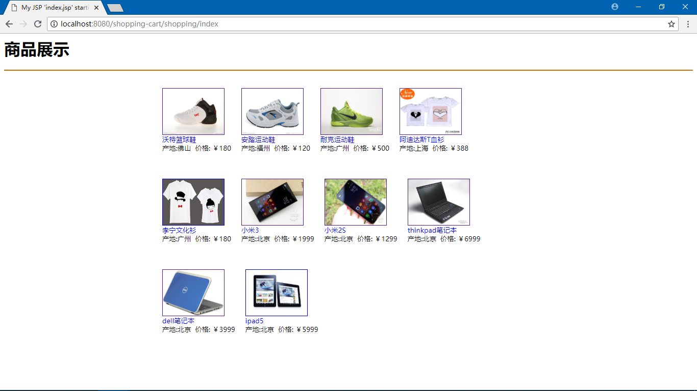
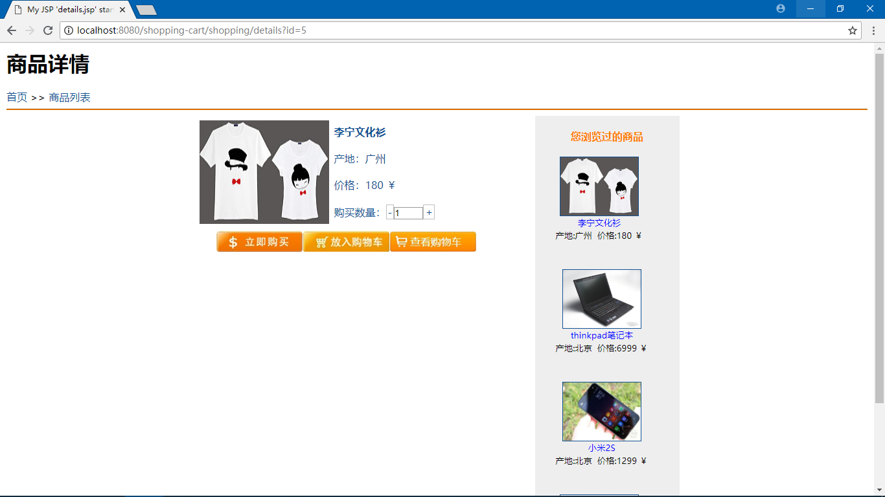
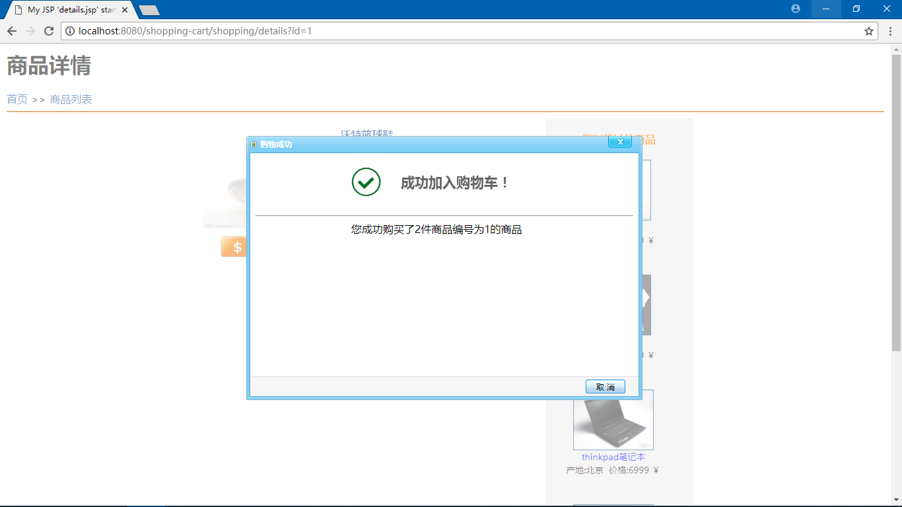
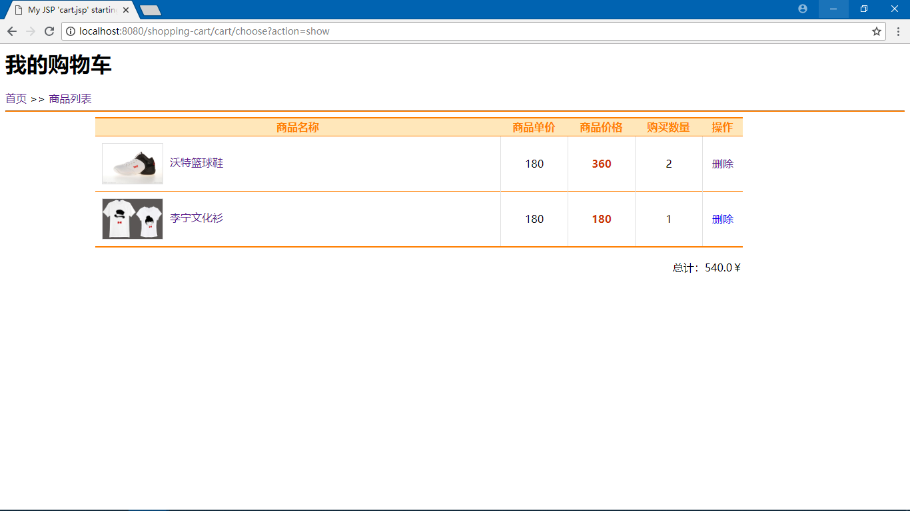

# shopping-cart
SSM整合后的一个及其简单的商城，首页数据是模拟的，主要测试购物车模块

## 启动

- git clone https://github.com/0saber0/shopping-cart
- 创建数据库：shopping
- 导入建表脚本：shopping.sql
- 修改db.properties
- 部署和启动项目（项目的path为项目名）
- 访问 http://localhost:8080/shopping-cart/shopping/index

## 技术栈

- spring
- spring-mvc
- mybatis
- mysql
- javascript
- freemarker

## 截图

